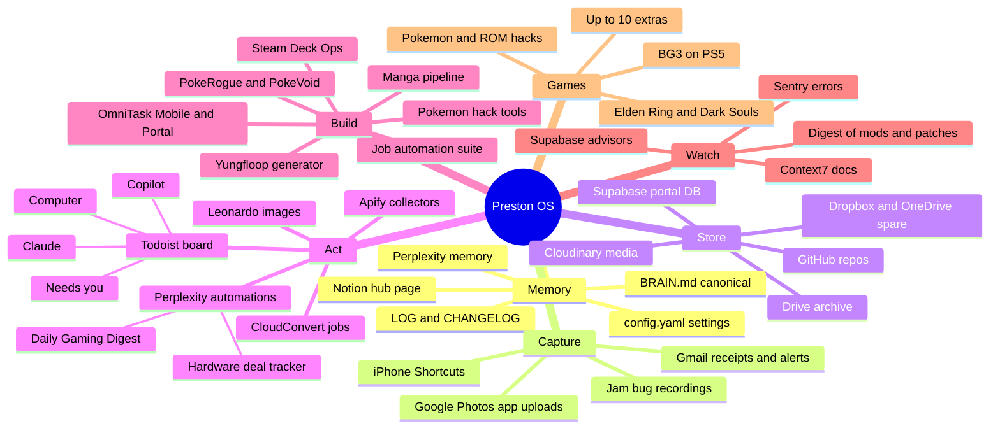

# Mind map: the whole system

GitHub renders this diagram on iPhone and desktop.

## How the pieces feed each other
1. Capture (iPhone, Gmail, Jam) lands in 00-INBOX or Todoist "Needs you".
2. Computer triages: durable facts go to BRAIN.md, settings to config.yaml, work to Todoist, results to LOG.md.
3. Builders (Copilot, Claude, Computer) open PRs; you merge from GitHub mobile.
4. Watchers (Sentry, Supabase advisors, the digest) raise new items back into capture.
